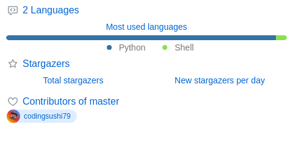

# Lumeo

**Language models, built from first light.**

Lumeo builds language models from scratch — no borrowed weights, no shortcuts.
We start with **Solis**, a mixture-of-experts model you can talk to today, with **Prism** and **Beacon** on the way.

**[lumeo.sushii.dev](https://lumeo.sushii.dev)**

---

## The family

Each model is built from the ground up for a different job, named for the way light behaves.

| Model | Focus | Status |
|---|---|---|
| [**Solis**](https://github.com/Lumeo-AI/Solis-1.0) | Conversation | ✅ Research preview |
| **Prism** | Reasoning | 🔬 In research |
| **Beacon** | Retrieval | 🛠️ In development |

## About Solis

A from-scratch sparse mixture-of-experts network — every token is routed through a
handful of specialized experts instead of the whole network.

- **334.9M** parameters — **122.6M** active per token
- **16** experts / layer, top-4 routing, plus 1 shared expert
- **16** layers · **768** wide · 12 query / 4 KV heads (GQA)
- **5,248**-token BPE vocabulary, learned on our own corpus
- **2,048** token context, rotary positions + RMSNorm

Solis is trained on a procedurally generated corpus — good for light conversation, not
for anything you need to be true. Full details in the
[model card](https://huggingface.co/Lumeo-AI/Solis-1.0).

## By the numbers

Generated daily by [lowlighter/metrics](https://github.com/lowlighter/metrics).

## Links

- 🌐 [lumeo.sushii.dev](https://lumeo.sushii.dev) — talk to Solis
- 🤗 [huggingface.co/Lumeo-AI](https://huggingface.co/Lumeo-AI) — weights and model cards
- 🔒 [Privacy Policy](https://lumeo.sushii.dev/privacy) · [Terms of Service](https://lumeo.sushii.dev/terms)
